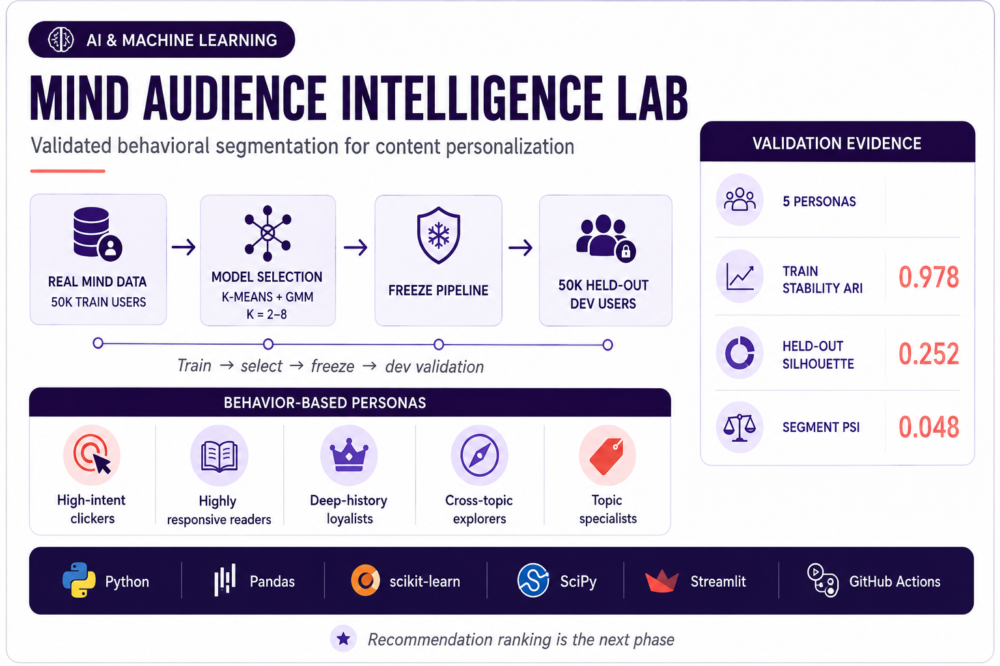

# Personalization Engine for Content Optimization



## Objective

Build and evaluate a content-personalization framework using the Microsoft MIND news recommendation dataset. The project tests whether behavioral user segmentation improves click prediction and provides a validated path toward recommendation ranking.

## Analytical approach

1. Parse MIND `behaviors.tsv` and `news.tsv`.
2. Engineer user-level interaction, recency, click, exposure, and topic-affinity features; use
   exposure-independent behavior rates and affinities for train/dev-comparable clustering.
3. Use MIND train data to compare K-Means and Gaussian Mixture candidates across 2–8 clusters.
4. Select the train model using separation, bootstrap stability, and segment-size viability.
5. Apply the frozen train preprocessing, model, and persona names to the untouched MIND dev split.
6. Measure validation separation, assignment strength, segment drift, and feature PSI.
7. Compare a content-only baseline with a model augmented by user behavior/segments.

The original analysis reported AUC of 0.57 for the baseline and 0.69 for the enhanced model. Those historical results should be reproduced through the versioned pipeline before being treated as a release benchmark.

## Run segmentation

Download MINDsmall and place its files under `data/MINDsmall_train/` and `data/MINDsmall_dev/`. The dataset is not redistributed in this repository.

```bash
python -m pip install -r requirements-dev.txt
python -m scripts.run_segmentation \
  --train-behaviors data/MINDsmall_train/behaviors.tsv \
  --train-news data/MINDsmall_train/news.tsv \
  --validation-behaviors data/MINDsmall_dev/behaviors.tsv \
  --validation-news data/MINDsmall_dev/news.tsv
python -m pytest -q
```

The development split never participates in preprocessing, cluster-count selection, model
fitting, or persona naming. It is used only as an out-of-sample validation population.

## What is validated

- MIND schema parsing and user-level feature engineering
- Robust preprocessing and outlier handling
- K-Means versus Gaussian Mixture model selection
- Silhouette, Davies–Bouldin, Calinski–Harabasz, and bootstrap ARI evidence
- Cluster-size guardrails and assignment-strength diagnostics
- Frozen-model validation on the MIND development split
- Train-versus-validation segment distribution and feature PSI drift evidence
- Python 3.11 and 3.12 CI

## Current boundaries

The Streamlit segmentation lab presents versioned outputs from the real MIND train/dev
pipeline: selected-model evidence, persona profiles, held-out validation, drift diagnostics,
and methodology. It intentionally reads compact result extracts rather than retraining during
an interactive session.

```bash
streamlit run app/streamlit_app.py
```

Recommendation ranking, React/FastAPI architecture, live integrations, and production
monitoring are separate future phases. Small MIND-schema records remain only as automated
software-test fixtures and are never used as analytical evidence or reported model results.

## Technology

Python, Pandas, NumPy, scikit-learn, SciPy, Streamlit, pytest, Ruff, and GitHub Actions.
